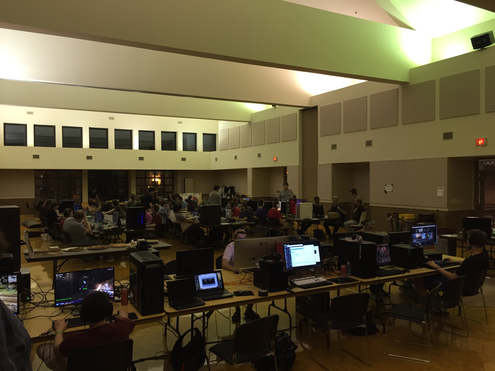

<!-- Banner -->
<!-- Note: The "styleN" class below should match that of the header element. -->
<section id="banner" class="style2">
	

		
			
		
		<header class="major">
			<h1>U of M, Morris CSci Club</h1>
		</header>
		

			
{{ page.description }}

		

	

</section>

<!-- Main -->

<!-- One -->
<section id="one" class="tiles">
	<article>
		
			
		
		<header class="major">
			<h3><a href="GeneralInfo.html" class="link">UMM CSci Club</a></h3>
			
General Information

		</header>
	</article>

	<article>
		
			
		
		<header class="major">
			<h3><a href="Spring2017LAN.html" class="link">Spring Semester LAN Party</a></h3>
			
Hot new details on the upcoming LAN party

		</header>
	</article>

	<article>
		
			
		
		<header class="major">
			<h3><a href="LanLegacy.html" class="link">LAN Party Legacy</a></h3>
			
Photos and posters from past LAN parties

		</header>
	</article>

	<article>
		
			
		
		<header class="major">
			<h3><a href="SponsorInfo.html" class="link">Sponsor Information</a></h3>
			
Interested in sponsoring an event?

		</header>
	</article>
</section>
<!--
<!-- One -->
<!-- <section id="one">
	

		<header class="major">
			<h2>UMM LAN Party</h2>
		</header>
		
The UMM LAN party is an open event held each semester by the Computer Science Club in Oyate hall. 

	

</section> -->

<!-- Two -->
<!-- <section id="style2" class="spotlights">
	<section>
		
		

			

				<header class="major">
					<h3>2017 Spring Semester LAN Party (Coming Up Next!)</h3>
				</header>
				
Get the hot new details on the upcoming LAN party!

				<ul class="actions">
					<li><a href="2017Spring.html" class="button">Learn more</a></li>
				</ul>
			

		

	</section>

	<section>
		
		

			

				<header class="major">
					<h3>All for Fun, and Fun for All!</h3>
				</header>
				
The UMM LAN Party offers a variety of games for students to play. 

				<ul class="actions">
					<li><a href="LANContent.html" class="button">Learn more</a></li>
				</ul>
			

		

	</section>

	<section>
		
		

			

				<header class="major">
					<h3>LAN Party Legacy</h3>
				</header>
				
See photos, posters, and other information about past LAN parties.

				<ul class="actions">
					<li><a href="LanLegacy.html" class="button">Learn more</a></li>
				</ul>
			

		

	</section>
</section> -->

